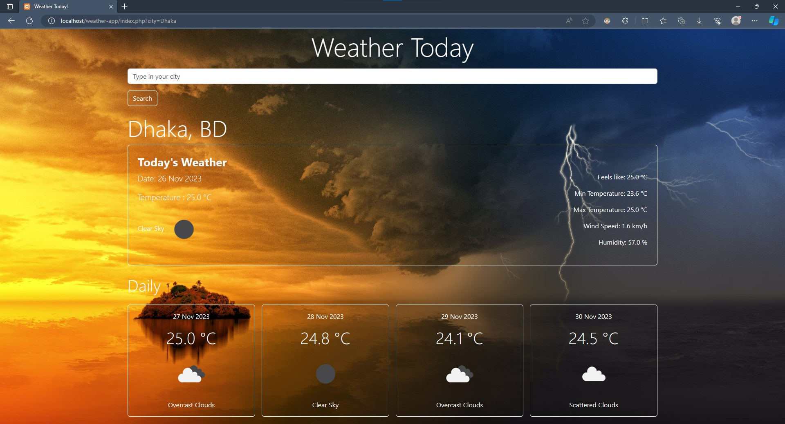

# weather-app-php
This repo contains the Assignment 4 of CSE309(Web Applications). It contains a weather app which uses OpenWeatherMap's API v2.5. Built using HTML, CSS(Bootstrap 5) and PHP. Site is dynamic and responsive.

## Screenshots

